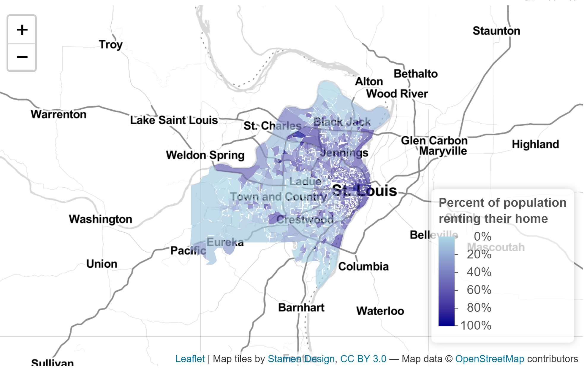

```{r setup, include=FALSE}
knitr::opts_chunk$set(echo = TRUE)
```

# Chicago, IL

This map of Chicago outlines the city's public parks and identifies locations of public art installations. 

[](https://ravjohn.github.io/Portfolio_F2021/fullsize/map1.pdf){target="_blank"}


This map demonstrates the following skills:

* Displaying multiple vector layers on the same map


# Boston, MA


This map shows the number of community centers, provided by the City of Boston and most recently updated in 2018, within each neighborhood. This map shows there are between 0 and 5 centers in each neighborhood and that the greatest number of community centers are located in the Dorchester neighborhood. It would be useful to look at the population of each neighborhood to consider the per capita distribution of community centers. Another aspect to consider is the specific locations of community centers, as a center near the border of a neighborhood could serve residents of multiple neighborhoods.

[](https://ravjohn.github.io/Portfolio_F2021/fullsize/map2.pdf){target="_blank"}


This map shows the Boston neighborhoods that contain a designated Main Street District. These are commercial district organizations that promote and attract commerce to the area. The map clearly shows a lack of districts in the downtown area, but does not indicate the amount to which each neighborhood contains a district. This map would be a good starting point to examine the effectiveness of or need for Main Street Districts in the highlighted neighborhoods, which are geographically larger and likely less dense.

[](https://ravjohn.github.io/Portfolio_F2021/fullsize/map3.pdf){target="_blank"}


These maps demonstrate the following skills:

* Calculating and displaying relationships among point and polygon layers based on distance
* Aggregating point data to a layer of polygons


# Madison, WI


This map shows a travel time matrix of how many minutes it takes to reach the nearest proposed bus rapid transit station in Madison, Wisconsin via walking or the existing transit network. This analysis assumes mid-winter conditions, as walking distances from the frozen lakes are included.

[](https://ravjohn.github.io/Portfolio_F2021/fullsize/map4.pdf){target="_blank"}


The travel time isochromes in this map further delve into the time it takes to reach a proposed BRT station via walking and existing transit, divided into 10 minutes, 20 minutes, and 30 minutes.

[](https://ravjohn.github.io/Portfolio_F2021/fullsize/map5.pdf){target="_blank"}


This map shows the of the number of proposed BRT stations within each hexagon of the grid created for the travel time analysis.

[](https://ravjohn.github.io/Portfolio_F2021/fullsize/map6.pdf){target="_blank"}


Accessibility of proposed BRT stops is shown below, illustrating the number of proposed BRT stations within a ten minute walk of each cell of the grid.

[](https://ravjohn.github.io/Portfolio_F2021/fullsize/map7.pdf){target="_blank"}


This map shows the Accessibility Score of proposed BRT stops, based on walking to each proposed stop.

[](https://ravjohn.github.io/Portfolio_F2021/fullsize/map8.pdf){target="_blank"}


This map shows the Madison street network overlayed on the BRT stop accessibility raster. It better highlights which areas of the city are inaccessible because the walking distance on sidewalks is far, and which areas are inaccessible because they are in the lakes.

[](https://ravjohn.github.io/Portfolio_F2021/fullsize/map9.pdf){target="_blank"}

This map shows accessibility of proposed BRT stops to pedestrians as polygons created from the grid cells above.


[](https://ravjohn.github.io/Portfolio_F2021/fullsize/map10.pdf){target="_blank"}


These maps demonstrate the following skills:

* Calculating and displaying accessibility, based on travel time
* Converting between raster layers and vector layers
* Displaying raster data on a map


# Miami, FL

This map draws the extents of 1 feet and 3 feet of sea level rise on a georeferenced street map from 1988.

[](https://ravjohn.github.io/Portfolio_F2021/fullsize/Sea Level Rise.pdf){target="_blank"}

This map demonstrates the following skills:

* Georeferencing a raster image


# St. Louis, MO

This interactive map of St. Louis City and St. Louis County shows the percent of individuals who rent their homes as of the 2010 census per block group.

[](https://ravjohn.github.io/Portfolio_F2021/fullsize/StL_rent.html){target="_blank"}

This map demonstrates the following skills:

* Displaying data on an interactive map
